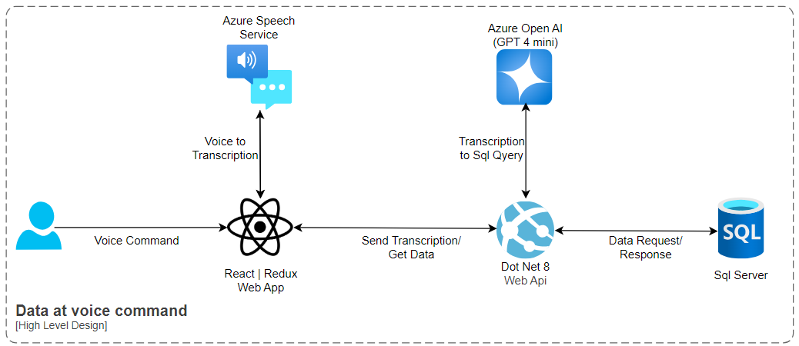

**DataAtVoiceCommands** project. A POC to provide data on voice command.

### Repository Structure
- **`src/`**: Contains the source code for the application.
- **`docs/`**: Includes documentation files and the architecture diagram (`hld.png`).
- **`tests/`**: Holds unit and integration tests for the project.
- **`config/`**: Configuration files for the application.

Refer to the architecture diagram in `docs/hld.png` for a detailed understanding of the system's design.

### High-Level Design Diagram

Below is the high-level design diagram illustrating the system's architecture:



This diagram provides a visual representation of the components and their interactions within the system.

Flow Explanation
👤 Voice Command (User Input)
The user initiates the process by speaking a query, such as “Show me all orders from last month.”
🎙️ Azure Speech Service
The voice input is sent to Azure Speech Service, which transcribes the voice command into plain text (transcription).
⚛️ React + Redux Web App
The transcribed text is returned to the React/Redux frontend, which handles the interaction layer.
This frontend then sends the transcription to the backend via a secure API call.
🌐 .NET 8 Web API
The backend receives the transcription and sends it to Azure OpenAI (GPT-4 mini).
GPT interprets the natural language and converts it into an appropriate SQL query.
🤖 Azure OpenAI (GPT-4 mini)
The AI model transforms the user's intent (in plain text) into a valid SQL query.
For example:
 “Show me all Orders from last month” → SELECT * FROM Orders WHERE Date >= DATEADD(month, -1, GETDATE())
🛢️ SQL Server
The generated SQL query is executed against the SQL Server.
The data retrieved is sent back through the Web API to the frontend.
📊 React/Redux UI
Finally, the requested data is displayed in the UI, completing the voice-to-data cycle.

### Configuration: AppSettings Changes

To ensure the application functions correctly, you may need to modify the `appsettings.json` file located in the `config/` directory. This file contains key configuration settings for the application, such as API keys, database connection strings, and service endpoints.

#### Key Sections in `appsettings.json` and `SpeechToText.jsx`:
1. **Azure Speech Service**:
    - Update the `SpeechService:ApiKey` and `SpeechService:Region` fields with your Azure Speech Service credentials.
    ```json
    "SpeechService": {
         "ApiKey": "your-azure-speech-api-key",
         "Region": "your-region"
    }
    ```

2. **Azure OpenAI Service**:
    - Provide the API key and endpoint for Azure OpenAI.
    ```json
    "OpenAI": {
         "ApiKey": "your-openai-api-key",
         "Endpoint": "https://your-openai-endpoint"
    }
    ```

3. **Database Connection**:
    - Configure the connection string for the SQL Server database.
    ```json
    "ConnectionStrings": {
         "DefaultConnection": "Server=your-server;Database=your-database;User Id=your-username;Password=your-password;"
    }
    ```

4. **Logging**:
    - Adjust logging levels if needed for debugging or production.
    ```json
    "Logging": {
         "LogLevel": {
              "Default": "Information",
              "Microsoft": "Warning",
              "System": "Warning"
         }
    }
    ```

#### Steps to Update:
1. Open the `appsettings.json` file in the `config/` directory.
2. Replace placeholder values with your actual credentials and configuration details.
3. Save the file and restart the application to apply the changes.

Ensure sensitive information like API keys and passwords are stored securely and not exposed in version control systems.
#

